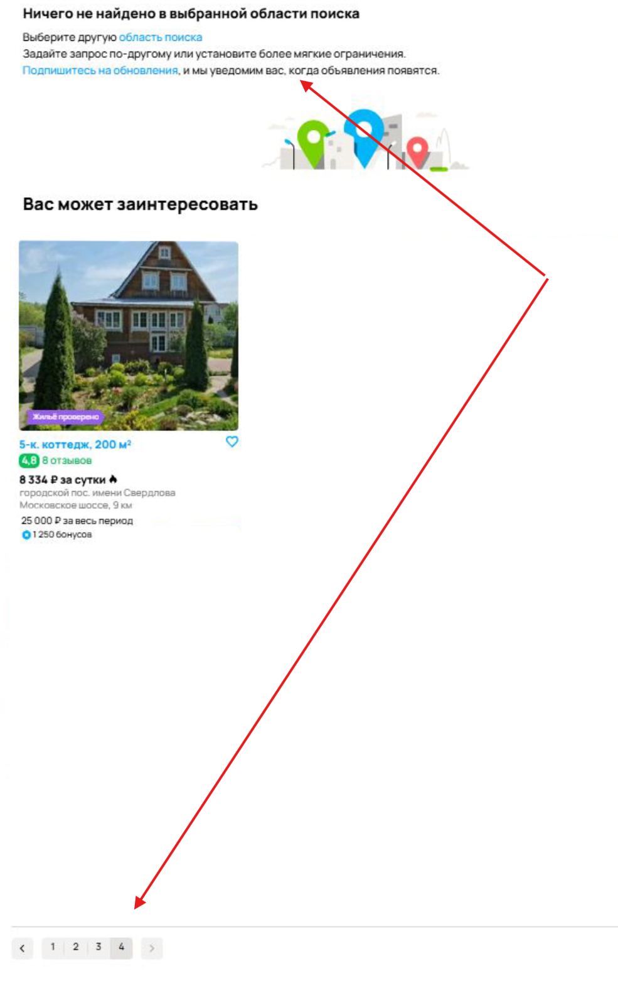

# Задание 1: Список багов

---

**1. Некорректный счётчик объявлений**  
Приоритет: High  
Счётчик показывает 6 объявлений, но отображается больше карточек. Это вводит пользователя в заблуждение.

---

**2. Некорректное сообщение о завершении списка**  
Приоритет: High  
Текст "Ничего не найдено в выбранной области поиска" отображается, хотя над ним показаны объявления.

---

**3. Некорректные регионы в выдаче**  
Приоритет: High  
Несмотря на выбор региона "Москва и МО", отображаются объявления из Санкт-Петербурга и Ленинградской области.

---

**4. Неверная фильтрация по цене**  
Приоритет: High  
Установлен фильтр до 50 000 ₽, но отображаются объявления с ценой выше этой суммы.

---

**5. Некорректное отображение выходных в календаре**  
Приоритет: Medium  
Суббота и воскресенье отображаются бледнее других дней. Неясно, является ли это ожидаемым поведением — требует уточнения.

---

**6. Некоторые карточки без указания местоположения**    
Приоритет: Medium  
Минимум две карточки не содержат информации о точном местоположении объекта.

---

**7. Непонятная карточка с доставкой (МОХОПТОМ)**    
Приоритет: Medium  
Карточка выглядит как товар с доставкой, что неуместно в разделе аренды недвижимости.

---

**8. Доступна пагинация, несмотря на сообщение об отсутствии объявлений**    
Приоритет: High  
Сообщение "Ничего не найдено..." противоречит наличию пагинации и доступных новых страниц.

---

**9. Карточка с рекламой среди объявлений**    
Приоритет: Medium  
Вместо фотографии недвижимости отображается баннер рекламного окна (бренд "ДОГМА").

---

**10. Карточка "Таунхаус 150 м²" содержит цену за месяц**    
Приоритет: Medium  
В разделе посуточной аренды указана цена "45 000 ₽ в месяц", что не соответствует формату раздела.

---

**11. Сортировка по дате работает некорректно**    
Приоритет: Medium  
При включенной сортировке по дате объявления отображаются в хаотичном порядке, без соблюдения сортировки.

---

**12. Несоответствие хлебных крошек и выбранного типа аренды**    
Приоритет: Medium  
В хлебных крошках указано "На длительный срок", хотя выбран раздел посуточной аренды.

---

**13. Карточка содержит изображение макета**  
Приоритет: Medium  
Карточка с подписью "Дом мечты. Де Агостини." содержит изображение миниатюрного домика, а не реального объекта недвижимости.

---